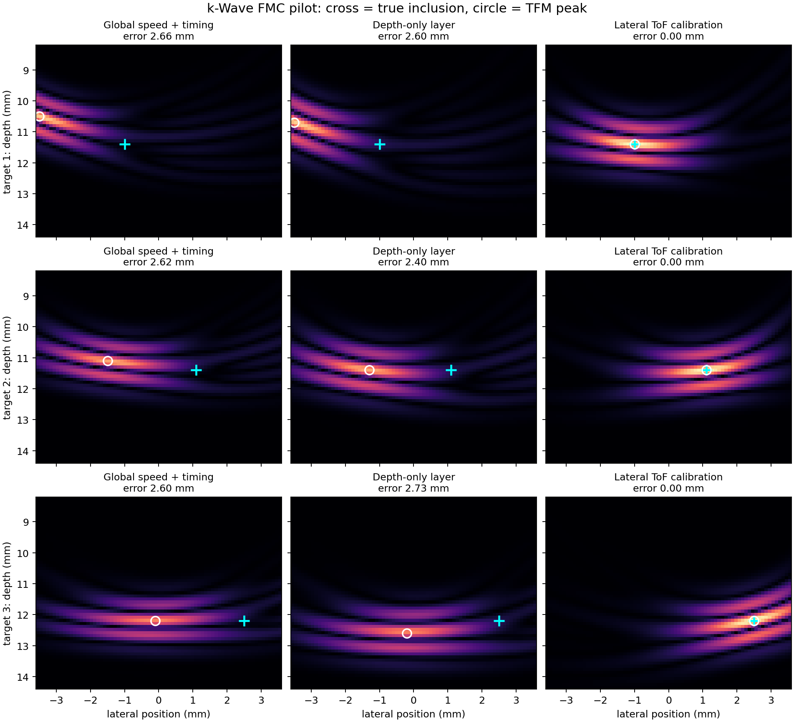

# Ultrasonic ToF Calibration for FMC/TFM

**Version 0.1.0 · research pilot**

This repository tests one question: can a few known ultrasonic reflectors calibrate a physically constrained time-of-flight (ToF) field and improve total focusing method (TFM) localization through a laterally varying layer?

The forward data are generated with the [k-Wave Python](https://github.com/waltsims/k-wave-python) 2D acoustic solver. Each array element transmits in turn while all eight elements receive, producing full matrix capture (FMC) data. Two known reflector locations calibrate a layered travel-time model. The fitted parameters are then used to focus three reflector positions excluded from calibration.



The cross marks the simulated reflector center; the circle marks the brightest TFM pixel. All methods search the same fixed imaging region.

| TFM delay model | Localization error on three held-out targets |
| --- | --- |
| Globally calibrated sound speed and timing | 2.60–2.66 mm |
| Calibrated lateral velocity model | At the target pixel on a 0.1 mm imaging grid |

The 0.1 mm grid result is **not** a demonstrated real-world accuracy. All three targets share one simulated material field and one calibration set. The numerical model assumes the layer boundary, bulk speed, and Gaussian lens width are known. The FMC used for this pilot is reference-subtracted, and this 2D acoustic model does not represent elastic weld anisotropy, shear waves, or mode conversion. See [the detailed pilot report](docs/pilot-results.md) for the controls and limitations. This is a reproducible feasibility test, not a validated flaw-sizing method or a claim that ToF correction is a new idea.

## Installation

Python **3.10+** is required. The experiment was run on Windows with Python 3.12, k-Wave Python **0.6.3rc1**, and its C++/OMP solver. The k-Wave package is installed as a dependency; its source and binaries are not copied into this repository.

```bash
python -m venv .venv
# Activate .venv for your shell, then:
python -m pip install -e .
```

The first k-Wave run may need to retrieve its platform solver binary. Linux and macOS support are not verified for this repository version.

## Reproduce the simulation

From the repository root:

```bash
tof-calibration-pilot --lens-delta -1200 --fit-lens-center --out outputs/center
```

This performs the full k-Wave FMC sequence for the reference, two calibrators, and the center held-out target. It writes `pilot_data.npz` and `results.json` under `outputs/center`. The `outputs/` directory is excluded from Git.

The repository also includes [small example FMC arrays](examples/) so the fitting and TFM reconstruction can be rerun without repeating the k-Wave forward solves. For example:

```bash
tof-calibration-pilot --lens-delta -1200 --fit-lens-center \
  --target-x 1.1 --target-z 11.4 \
  --reuse-calibration examples/center/pilot_data.npz \
  --reuse-target examples/center/pilot_data.npz \
  --out outputs/recheck-center
```

On PowerShell, enter the same command on one line or replace the trailing `\` characters with PowerShell backticks. Other saved target positions are `(-1.0, 11.4)` mm in `examples/left` and `(2.5, 12.2)` mm in `examples/right`. Change the target arguments and `--reuse-target` path accordingly.

`pilot_data.npz` contains the time axis, element positions, reference FMC, reference-subtracted calibration FMC, target FMC, picked calibration arrival times, image axes, and TFM images. `results.json` records the simulation configuration, fitted parameters, and localization errors.

## Method and interpretation

For a pixel **x**, TFM samples the FMC trace for transmitter *i* and receiver *j* at

\[\tau_{ij}(\mathbf{x}) = T_i(\mathbf{x}) + T_j(\mathbf{x}).\]

The pilot fits a low-dimensional lateral velocity perturbation from known reflector arrivals, then computes the single-element travel times with a two-segment Fermat path. It compares this against nominal speed, calibrated global speed plus timing offset, and a depth-only layer. In a uniform-layer control, global speed plus timing offset was already sufficient; the lateral model became useful only when the layer varied across the array.

Earlier work has already used learned weld structure to correct TFM delays; see [Singh et al., *Applied Sciences* 12, 532 (2022)](https://doi.org/10.3390/app12020532). The next research task is to test whether calibration still works with uncertain material geometry, raw FMC, noise, independent material fields, and elastic wave propagation.

## Version and license

The current release is **v0.1.0**. Changes are tracked in [CHANGELOG.md](CHANGELOG.md). This repository's original code and documentation are available under the [MIT License](LICENSE). k-Wave is a separate dependency with its own license.
